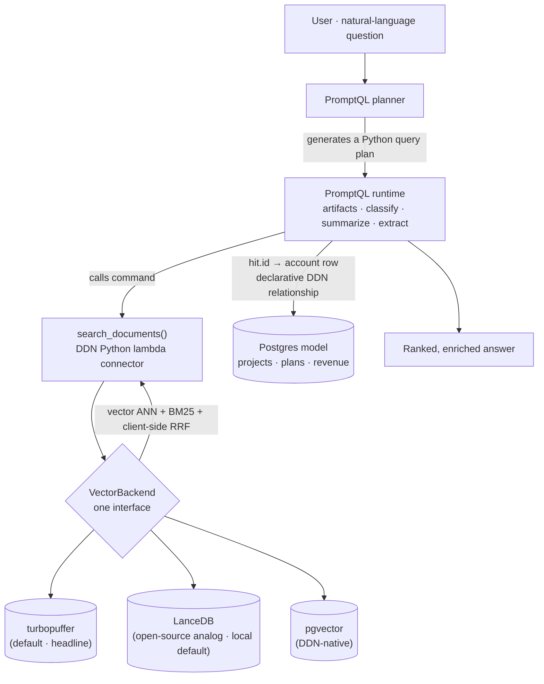

# retrieval-bridge

[](https://github.com/viper9503/retrieval-bridge/actions/workflows/ci.yml) [](LICENSE)  

**Hybrid (vector + keyword) retrieval as a swappable backend for [PromptQL](https://promptql.io), with [turbopuffer](https://turbopuffer.com) as the headline default — joined to it through the seam Hasura DDN already gives you: a lambda connector.**

> One natural-language question → PromptQL generates a deterministic query plan → the plan calls a `search_documents` command → that command runs **hybrid retrieval** (semantic + exact-keyword) → PromptQL classifies, summarizes, joins structured facts, and ranks. The retrieval backend behind the command is **swappable** (turbopuffer · LanceDB · pgvector) without changing a line of the PromptQL-facing interface.

---

## The pitch in one paragraph

PromptQL gives you planning, deterministic execution, and reasoning primitives (`classify` / `summarize` / `extract` / `visualize`) — but it still needs a way to narrow millions of unstructured documents down to the handful worth reasoning over. turbopuffer is exactly that step: serverless **hybrid** search (vector for meaning + BM25 for exact tokens like SKUs, error codes, IDs) over object storage, at roughly a tenth of the cost of in-memory vector DBs. The two meet at a mechanism DDN *already* exposes — the **lambda connector** — so turbopuffer becomes a first-class `search_documents` command with zero bespoke plumbing. And because the backend lives behind a one-method interface, turbopuffer is the default but **not a lock-in**: LanceDB (its open-source, object-storage-native analog) or pgvector drop in unchanged. This repo proves all of that, end to end, and runs with **no API keys**.

---

## Why this combination is worth your attention

| Layer | Job | Why it's the right tool |
|---|---|---|
| **turbopuffer** | High-recall, low-cost **retrieval**: millions → dozens | Vector **+ BM25** hybrid fixes the pure-vector blind spot on exact tokens (error codes, IDs). Serverless on S3/GCS → ~10× cheaper than RAM-resident vector DBs. |
| **PromptQL** | **Planning + deterministic execution + reasoning** | The plan is a *Python program*, not one SQL string — it adapts mid-run, stores artifacts outside the LLM context, and calls focused LLM primitives only where judgment is needed. This is explicitly **not** "RAG as the whole answer." |
| **Postgres (DDN)** | **Structured facts** joined to retrieved candidates | A retrieved ticket id joins to its account row (plan, revenue) via a **declarative DDN relationship** — no join code. |

Retrieval is a *deterministic tool inside the plan*, not the answer. That's the framing PromptQL stands for, and turbopuffer slots into it cleanly.

---

## Architecture



<details>
<summary>Same flow as ASCII (for non-Mermaid viewers)</summary>

```
User (natural language)
        │
        ▼
   PromptQL planner ───────────────► generates a Python query plan
        │                                    │
        │                                    ▼
        │                         calls command: search_documents(query, top_k, filters)
        │                                    │
        ▼                                    ▼
  PromptQL runtime  ◄──── Hasura DDN ──── Python lambda connector
   • artifacts                                  │
   • classify / summarize / extract             ▼
        │                            VectorBackend  (one interface)
        │                          ┌──────────────┬───────────────┐
        │                    turbopuffer       LanceDB         pgvector
        │                    (default)      (open-source     (DDN-native)
        │                                    analog/local)
        ▼
  Postgres model (projects · plans · revenue)
        ▲
        └── joined to each hit by a declarative DDN relationship (hit.id → account row)
```

</details>

The exact same `search_documents` runs in the local demo and in the deployed connector — see [retrieval_bridge/search.py](retrieval_bridge/search.py) and [ddn/connector/search/functions.py](ddn/connector/search/functions.py).

---

## Quickstart (zero API keys, ~2 minutes)

Requires Python 3.10+ (the demo). The default path uses **local embeddings** (fastembed/BGE-small) and an **embedded LanceDB** store — nothing to sign up for.

```bash
git clone https://github.com/viper9503/retrieval-bridge.git
cd retrieval-bridge
python -m venv .venv && source .venv/bin/activate      # or: uv venv
pip install -e .                                        # base = local + LanceDB

python data/generate_corpus.py     # 160 synthetic support tickets (deterministic)
python scripts/seed.py             # embed + index (first run downloads BGE once)
python scripts/demo.py             # the end-to-end query plan
python scripts/bench.py            # proof: hybrid beats pure-vector on exact tokens
```

`demo.py` executes the full plan a PromptQL prompt would generate — retrieve → classify root cause → summarize the fix → join account facts → rank by plan tier and recency — and prints each step so the division of labor is visible.

### Run it against real turbopuffer (optional)

```bash
pip install -e ".[turbopuffer]"
export TURBOPUFFER_API_KEY=...            # see docs/turbopuffer-runbook.md
export TURBOPUFFER_REGION=gcp-us-central1
RETRIEVAL_BRIDGE_BACKEND=turbopuffer python scripts/seed.py
RETRIEVAL_BRIDGE_BACKEND=turbopuffer python scripts/demo.py
```

The plan and the command signature are **identical** — only where the two sub-queries run changes.

---

## Swappable backends

| Backend | Install | Role | Hybrid |
|---|---|---|---|
| **LanceDB** (default) | base | Zero-infra, embedded, object-storage-native — the open-source turbopuffer analog and clone-and-run default | vector + native FTS + client-side RRF |
| **turbopuffer** | `.[turbopuffer]` | The headline: serverless hybrid at scale | vector + BM25 multi-query + client-side RRF |
| **pgvector** | `.[pgvector]` | Lowest friction inside DDN (native Postgres connector) | vector + `tsvector` + client-side RRF |

All three implement the same [`VectorBackend`](retrieval_bridge/backends/base.py) protocol and reuse the same [`reciprocal_rank_fusion`](retrieval_bridge/fusion.py). "Hybrid" means the same thing everywhere — turbopuffer has **no server-side fusion**, so RRF is client-side by design, and the local backends mirror that faithfully.

---

## Repo layout

```
retrieval_bridge/        # the backend-agnostic core (shared by demo AND connector)
  types.py               #   Hit / Document contracts
  fusion.py              #   reciprocal-rank fusion (the client-side hybrid step)
  embedders/             #   local BGE (default) + OpenAI/Voyage/Cohere (asymmetric-aware)
  backends/              #   lancedb (default) + turbopuffer + pgvector
  search.py              #   RetrievalBridge.search_documents  <- the command body
  structured.py          #   SQLite structured store (the DDN Postgres-join analog)
  demo_primitives.py     #   offline stand-ins for executor.classify/summarize
data/generate_corpus.py  # synthetic support tickets (semantic + exact tokens)
scripts/                 # seed.py · demo.py · bench.py
ddn/                     # the deployable DDN connector + HML metadata + runbook
docs/                    # architecture, pitch, query-plan walkthrough, runbooks
```

---

## Going live (turbopuffer + PromptQL)

Two runbooks, because you have PromptQL access but haven't set up turbopuffer or the DDN CLI yet:

- **[docs/turbopuffer-runbook.md](docs/turbopuffer-runbook.md)** — sign up, get a key, choose a region, seed a real namespace. ⚠️ turbopuffer has **no free tier** (lowest plan is $64/mo minimum, with a 30-day refund window) — which is exactly why the local default exists: the demo is free and the upgrade is one env var.
- **[docs/ddn-runbook.md](docs/ddn-runbook.md)** — install the DDN CLI, drop in the lambda connector, register the `search_documents` command, add the Postgres model + relationship, and point your existing PromptQL project at it.
- **[docs/query-plan-walkthrough.md](docs/query-plan-walkthrough.md)** — the demo prompt and the query plan PromptQL is expected to generate, annotated.

---

## A note on accuracy

Every external API in this repo was verified against **live documentation (June 2026)**, not training memory — which caught several breaking drifts (turbopuffer's v2 API + region-scoped hosts, the `ndc_sdk_python` connector imports, the four PromptQL primitives, Voyage `voyage-3` deprecation). See [docs/verified-facts.md](docs/verified-facts.md) for the citations behind the build.

## Docs

- [docs/pitch.md](docs/pitch.md) — the extended pitch (why this combination matters)
- [docs/architecture.md](docs/architecture.md) — architecture deep dive
- [docs/query-plan-walkthrough.md](docs/query-plan-walkthrough.md) — the demo prompt + the PromptQL plan it should generate
- [docs/turbopuffer-runbook.md](docs/turbopuffer-runbook.md) — go live on real turbopuffer
- [docs/ddn-runbook.md](docs/ddn-runbook.md) — wire the connector + relationship into DDN/PromptQL
- [docs/verified-facts.md](docs/verified-facts.md) — every external API, verified against live docs
- [docs/recruiter-blurb.md](docs/recruiter-blurb.md) — copy-paste blurb + a 60-second demo script

## License

MIT — see [LICENSE](LICENSE).
